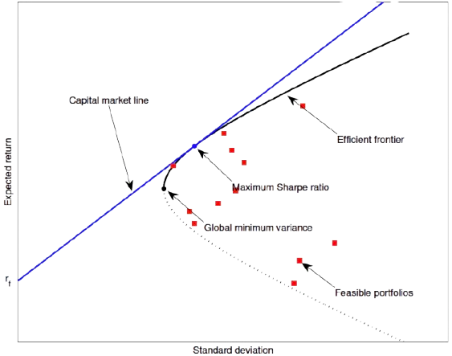

```{r, include = FALSE}
current_file <- knitr::current_input()
basename <- gsub(".Rmd$", "", current_file)

knitr::opts_chunk$set(
  fig.path = "images/",
  fig.width = 6,
  fig.height = 4,
  fig.align = "center",
  fig.retina = 3,
  echo = TRUE,
  warning = FALSE,
  message = FALSE#,
  #cache = TRUE,
  #cache.path = "cache/"
)
```


class: middle center hide-slide-number monash-bg-gray80


```{r, include = FALSE}
basename <- ifelse(exists("basename"), basename, "slide")
pdflink <- ifelse(is.null(rmarkdown::metadata$pdflink),
                  paste0(basename, ".pdf"),
                  rmarkdown::metadata$pdflink)
```


.info-box.w-50.bg-white[
These slides are viewed best by Chrome or Firefox and occasionally need to be refreshed if elements did not load properly. See <a href="`r pdflink`">here for the PDF <i class="fas fa-file-pdf"></i></a>. 
]

<br>

.white[Press the **right arrow** to progress to the next slide!]


---


background-size: cover
class: title-slide
count: false

# .monash-blue[`r rmarkdown::metadata$title`]

<br>

<h2 style="font-weight:900!important;">`r rmarkdown::metadata$subtitle`</h2>

.bottom_abs.width100[

Presenter: *`r rmarkdown::metadata$author`*

<i class="fas fa-university"></i> `r rmarkdown::metadata$department`, <Br>&nbsp;&nbsp;&nbsp;&nbsp;&nbsp;University of Córdoba, Spain.

<i class="fas fa-envelope"></i>  `r rmarkdown::metadata$email`

<a href="https://twitter.com/caroisallin" style="color:black"><i class="fab fa-twitter"></i> @caroisallin</a>

<i class="fas fa-calendar-alt"></i> `r rmarkdown::metadata$date`

<br>

]


---

class: footer-slide
layout: true
name: footer


.footnote.monash-black.f4[
<i class="fas fa-link"></i> <a href="https://github.com/jrcarob/UCLouvain" style="color:#6F7C4D!important;">UCLouvain Teaching Material and Slides</a>
]

---


# .monash-purple2[A little about me] 

.flex[
.w-40[

## Your friendly neighbor 

<center>
</center>
]

.w-60[

### José Caro

* **Assistant Professor** at the University of Córdoba, Spain 🇪🇸 

* **7 years teaching** 🎓

  - Statistics & Quantitative Methods for Business & Economics
  
  - Financial Mathematics
  
  - Microeconomics

* Previously worked as **Financial Controller** at KME 📦
  
* **Research Interests**

  - Demography & Demographic Models
  
  - Applied Statistics & Econometrics to Financial Markets

  - Econophysics

]
]

--

.absolute.bottom-3.right-1[
.info-box.w-100[
**Friendly advice:** You are kindly invited to visit Córdoba
]
]

---

# .monash-purple2[Contents]

<br>

.f1[

.circle.monash-bg-blue.white[1] <b><i class="fas fa-project-diagram"></i> Introduction: What is Portfolio Optimization</b> .f3[]
<br>

.circle.monash-bg-blue.white[2] <b><i class="fas fa-wrench"></i> Theoretical Foundations</b> .f3[]
<br>

.circle.monash-bg-blue.white[3] .monash-blue2[<b><i class="fas fa-chart-bar"></i> R As a Tool for Financial Analysis</b>] .f3[]
<br>

.circle.monash-bg-blue.white[4] <b><i class="fas fa-question"></i> Key Takeaways & Q&A</b> .f3[]
<br>

.circle.monash-bg-blue.white[5] <b><i class="fas fa-laptop-code"></i> Simulation with Excel</b> .f3[]
<br>
]

---

class: transition  animated slideInLeft

# .circle-big[1] 

# What is Portfolio Optimization

<span style="font-size:20pt; ">**_"Diversification is the only free lunch in investing."_** - Harry Markowitz, 1927-2023</span>

<br><br>

.f3.center.w-100[

**Reference:** Berk, J. & DeMarzo, P.: _Corporate Finance_, 6th Ed., *Springer-Verlag New York* (2024)

]

---

# Corporate Finance

<br><br>

.f1.center[
.animated.bounce[
.monash-blue[<b><i class="fas fa-project-diagram"></i>1. Introduction: What is Portfolio Optimization</b>]
]


.monash-ruby2[**1.1 Defining Investment Goals (Risk vs. Return)**

**1.2 Diversification Benefits**

**1.3 Importance of Portfolio Construction**
]

{{content}}

<br>

**What do we mean by “_optimization_"?**

]

---

# .monash-purple2[How Risk Affects Investor Decisions and Returns?]

<br><br>

<center></center>

---

# .monash-purple2[How Risk Affects Investor Decisions and Returns?]

.monash-green2[_Suppose your great-grandparents invested 100USD on your behalf at the end of 1925. They instructed their broker to reinvest any dividends or interest earned in the account until the beginning of 2025. How would that 100USD have grown if it were placed in one of the following investments?_]<br>
--

**1. Standard & Poor’s 500:** A portfolio, constructed by Standard and Poor’s 500 U.S. companies stocks.<br>
--

**2. Small Stocks:** A portfolio, updated quarterly, of U.S. stocks traded on the NYSE with market capitalizations in the bottom 20%.<br>
--

**3. World Portfolio:** A portfolio of international stocks from all of the world’s major stock markets in North America, Europe, and Asia.<br>
--

**4. Corporate Bonds:** A portfolio of long-term, AAA-rated U.S. corporate bonds with maturities of approximately 20 years.<br>
--

**5. Treasury Bills**: An investment in one-month U.S. Treasury bills.<br>
--

.monash-red2[**6. Cryptocurrencies???** A portfolio of combination of altcoins...?? Wait!! What??!!<br>Well, if your great-grandparents were alive seeing you doing this...]🤯<span style="font-size:25pt; ">🤯</span><span style="font-size:35pt; ">🤯</span><span style="font-size:45pt; ">🤯</span><span style="font-size:65pt; ">🤯</span>

---

# .monash-purple2[How Risk Affects Investor Decisions and Returns?]

<center>
<br><p style="font-size:16px; ">Source: Chicago Center for Research in Security Prices, Standard and Poor’s, MSCI, and Global Financial Data</p></center>

---

# .monash-purple2[The Importance of Time... and Risk]

<center>
<br><p style="font-size:16px; ">Source: Chicago Center for Research in Security Prices, Standard and Poor’s, MSCI, and Global Financial Data</p></center>

---

# .monash-purple2[Historical Data: Some ETF Prices]

<center>
<br><p style="font-size:16px; ">Source: Chicago Center for Research in Security Prices, Standard and Poor’s, MSCI, and Global Financial Data</p></center>

---

# .monash-purple2[Historical Data: Returns vs. Volatility]

Important observation: .monash-green2[_**volatility**_] is easy to see, .monash-green2[_**mean return**_] is lost in the noise.

<center>
<br><p style="font-size:16px; ">Source: Chicago Center for Research in Security Prices, Standard and Poor’s, MSCI, and Global Financial Data</p></center>

---

# .monash-purple2[Defining Investment Goals: Risk vs. Return]

.think-box.w-88[_"**Risk comes from not knowing what you're doing**"_ - Warren Buffett]

--

.work-box[
**Risk:** uncertainty associated with the returns of an investment.

Markowitz defined _risk_ as the variability of the returns as measured by the historical variances:
$$risk_j=\frac{1}{T}\sum_{t=1}^{T}\big(R_j(t)-reward_j\big)^{2}.$$
]

--

.aim-box[
**Return:** _gain_ or _loss_ on an investment over a specified period, typically expressed as a percentage of the investment's initial cost.
]

---


# .monash-purple2[Diversification Benefits]

Diversification is a **risk management strategy** that involves spreading investments across various financial instruments, industries, and other categories to reduce exposure to any single asset or risk. The idea is that a diversified portfolio will, on average, yield higher returns and pose a lower risk than any individual investment found within the portfolio.

--

-	**Risk Reduction:** by holding a variety of assets, the impact of a poor-performing investment is mitigated by the better performance of other investments.

--

-	**Smoother Returns:** a diversified portfolio tends to have more stable returns over time.

--

- **Improved Risk-Adjusted Returns:** allows investors to achieve a higher return per unit of risk (*_Sharpe Ratio*).

--

- **Exposure to Multiple Opportunities:** ensures that investors are not overly reliant on a single asset or sector, allowing them to benefit from growth in different areas of the market.

---

# .monash-purple2[Diversification Benefits: How it works. The Role of Correlation]

.monash-ruby2[**Correlation:**] statistical measure that describes the degree to which two assets move in relation to each other. $$\sigma_{p}^{2}=w_{1}^{2}\sigma_{1}^{2}+w_{2}^{2}\sigma_{2}^{2}+2w_{1}w_{2}\sigma_{1}\sigma_{2}\rho_{1,2}$$

**Where**

- $\sigma^{2}_{p}=$ Portfolio variance

- $w_{1}w_{2}=$ Weights of the two assets in the portfolio

- $\sigma_{1}\sigma_{2}=$ Standard deviations (volatility) of the two assets

- $\rho_{1,2}=$ Correlation between the two assets

**It ranges from -1 to +1**:

- **If** $\rho_{1,2}=+1$: perfect positive correlation. Variance is maximized, and there is no diversification benefit.

- **If** $\rho_{1,2}=-1$: perfect negative correlation. Variance is minimized, and diversification is most effective.

- **For** $-1<\rho_{1,2}<+1$: the portfolio variance is reduced, but not eliminated.

--

.absolute.bottom-3.right-1[
.idea-box[**Key Insight:**<br>
Diversification is most effective when assets have **low or negative correlation**. This means that when one asset performs poorly, another may perform well, balancing the overall portfolio
]
]

---

# .monash-purple2[Importance of Portfolio Construction]

Process of **strategically selecting and combining assets** to achieve an optimal balance between risk and return. **Primary goal:** to maximize returns for a given level of risk or minimize risk for a given level of return.

.aim-box[**Practical Steps in Portfolio Construction:**<br>
-	**Define Investment Objectives:** Determine the investor’s goals, time horizon, and risk tolerance.

- **Asset Allocation:** Decide the proportion of funds to allocate to different asset classes (e.g., equities, bonds, real estate, commodities).

- **Security Selection:** Choose specific securities within each asset class based on fundamental and technical analysis.

- **Portfolio Optimization:** Use mathematical models (e.g., mean-variance optimization) to find the optimal mix of assets that maximizes return for a given level of risk.

-	**Rebalancing:** Periodically **adjusting the portfolio** to maintain the desired asset allocation.

]

---

class: transition  animated slideInLeft

# .circle-big[2] 

# Theoretical Foundations

<span style="font-size:20pt; ">**_"Rule No.1: Never lose money. Rule No.2: Never forget rule No.1."_** - Warren Buffett, 1930-</span>

<br><br>

.f3.center.w-100[

**Reference:** Berk, J. & DeMarzo, P.: _Corporate Finance_, 6th Ed., *Springer-Verlag New York* (2024)

]

---

# Corporate Finance

<br><br>

.f1.center[
.animated.bounce[
.monash-blue[<b><i class="fas fa-project-diagram"></i>2. Theoretical Foundations</b>]
]

.monash-ruby2[**2.1 Primer on Financial Data: Modeling the Returns & Performance Measures**

**2.2 Markowitz's Modern Portfolio Theory (_MPT_)**

**2.3 A Practical Example**
]

{{content}}
]

---

# .monash-purple2[2.1 How do we Model Returns? Simple vs. Log-Returns]

.flex.h-80[
.w49[

- For stocks, returns are used for the modeling since they are “_stationary_” (as opposed to the previous random walk).

.aim-box.w-100[
**Simple Returns** or net returns are: $$R_{t}\triangleq\frac{p_t-p_{t-1}}{p_{t-1}}=\frac{p_t}{p_{t-1}}-1$$
]

.aim-box[
**Log-returns** or continuously compounded:
$$r_t\triangleq y_t-y_{t-1}=\log\frac{p_t}{p_{t-1}}=\log(1+R_{t})$$
<a href="#36" style="font-size:12pt"><i class="fas fa-caret-right"></i> The world of returns</a>
]
]

.w6[
<p style="color:white;">g</p>
]


.w49[

.think-box[
**Why we use log-returns:**<br>
- _**Time-Additivity:**_ Log returns can be added over multiple periods, which simplifies analysis and modeling.

- _**Normal Distribution:**_ Making them more suitable for statistical methods and models.

- _**Compounding:**_ Better accounts for the compounding effect over time.

- _**Zero Boundary:**_ Log returns naturally bound asset prices at zero.
]

]

]

--

.absolute.bottom-3.right-1[
.info-box.w-93[
.f4[
[More resources on Log-returns including `R` simulation](https://github.com/jrcarob)
]
]]

---

# .monash-purple2[2.1 Asset Log-Returns]

- Let $p_t$ be the price of an asset at (discrete) time index $t$

- The fundamental model is based on modeling the log-prices $y_t\triangleq\log p$ as a random walk:
$$y_t=\mu+y_{t-1}+\epsilon{_t}$$


---

# .monash-purple2[2.1 Asset Log-Returns: Volatility Clustering]


---

name: returns

# .monash-purple2[2.1 The World of Returns]

- In practice, we don't just deal with one asset but with a whole universe of $N$ assets.

- We denote the log-returns of the $N$ assets at time $t$ with the vector $\mathbf{r}_t\in\mathbb{R}^{N}$. 

- The time index $t$ can denote any arbitrary period such as days, weeks, months, minutes intervals, etc.

- $\mathcal{F}_{t-1}$ denotes the previous historical data.

- Econometrics aims at modeling $\mathbf{r}_t$ conditional on $\mathcal{F}_{t-1}$ and assume that follows an i.i.d. distribution.

- That is, both the **conditional mean and conditional covariance** are constant:

$$\begin{align}
\mu_t&=\mu\\
\Sigma_t&=\Sigma
\end{align}$$

.idea-box[
Very simple model, but its fundamental assumptions was very important for the Nobel prize-winning Markowitz’s portfolio theory (Markowitz, 1952)<sup>1</sup>
]

.footnote.f4.monash-blue2[
<sup>1</sup>H. Markowitz (1952): Portfolio Selection, _Journal of Finance_, vol.7, nº 1, pp 77-91.<br><br><br>
]

---

# .monash-purple2[2.1 Portfolio Return]

- Suppose the capital budget is $B$ USD.

- The portfolio $\mathbf{W}\in\mathbb{R}^{N}$ denotes the normalized USD weights of the $N$ assets such that $\mathbf{1}^{T}\mathbf{W}=1$

- For each asset $i$, the initial wealth is $Bw_{i}$ and the wealth is $$Bw_{i}(p_{i,t}/p_{i,t-1})=Bw_{i}(R_{it}+1).$$

- Then, the **portfolio return** is $$R_{t}^{p}=\frac{\sum_{i=1}^{N}Bw_{i}(R_{it}+1)-B}{B}=\sum_{i=1}^{N}w_{i}R_{it}\approx\sum_{i=1}^{N}w_{i}r_{it}=\mathbf{w}^{T}\mathbf{r}_{t}$$

- The portfolio expected return and variance are $\mathbf{w}^{T}\mu$ and $\mathbf{w}^{T}\mathbf{\Sigma w}_{t}$, respectively.

---

# .monash-purple2[2.1 An Example on Portfolio Returns<sup>2</sup>]

.work-box[
.f4[
We buy 200 shares of Dolby Labs at 30USD per share and 100 shares of Coca-Cola stock at 40USD per share. If Apple’s share price goes up to 36USD and Netflix’s falls to 38USD, what is the new value of the portfolio, and what return did it earn? After the price change, what are the new portfolio weights?
]
]

--

.code-box[
.f4[
New value of the portfolio: $200\times 36USD + 100\times 38USD = 11.000USD$, for a gain of $1.000USD$ or a 10% return on your $10.000USD$ investment. Dolby’s return was $36/30 − 1 = 20\%$, and Coca-Cola’s was $38/40 − 1 = −5\%$. Given the initial portfolio weights of 60% Dolby and 40% Coca-Cola, we can also compute the portfolio’s return:
$$R_{P}=x_{D}R_{D}+x_{C}R_{C}=0.6\times(20\%)+0.4\times(-5\%)=10\%$$
After price change, the new portfolio weights are: $$x_{D}=\frac{200\times 36USD}{11.000USD}=65.45\%,\qquad x_{C}=\frac{100\times 38USD}{11.000USD}=34.55\%$$
]
]

.footnote.f4.monash-blue2[
<sup>2</sup>Berk, J. & DeMarzo, P.: _Corporate Finance_, 6th Ed., *Springer-Verlag New York* (2024).<br><br><br>
]

---

# .monash-purple2[2.1 An Example on Portfolio Expected Return<sup>2</sup>]

.work-box[
Suppose we invest $10.000USD$ in Meta Platforms (Facebook) stock, and $30.000USD$ in Honeywell International stock. We expect a return of 10% for Facebook and 16% for Honeywell. What is your portfolio’s expected return?
]

--

.code-box[
Our investment is $40.000USD$ in total, so our portfolio weights are $10.000/40.000=0.25$ in Facebook and $30.000/40.000=0.75$ in Honeywell. Therefore, our portfolio's expected return is $$E[R_p]=x_FE[R_F]+x_HE[R_H]=0.25\times10\%+0.75\times16\%=14.5\%$$
]

.footnote.f4.monash-blue2[
<sup>3</sup>Berk, J. & DeMarzo, P.: _Corporate Finance_, 6th Ed., *Springer-Verlag New York* (2024).<br><br><br>
]

---

# .monash-purple2[2.1 Performance Measures]

- .monash-ruby2[**Probability Distributions:**] likelihoold of occurring a possible return: $p_R$

- .monash-ruby2[**Expected Returns:**] weighted average of the possible returns: $$\mathbf{E}[R]=\sum_{R}x_i\times R,\text{where}\quad x_i=\frac{\text{Value of investment}\ i}{\text{Total value of portfolio}}$$

- .monash-ruby2[**Variance and Standard Deviation:**]
$$Var(R)=\mathbf{E}\bigg[\big(R-\mathbf{E}[R]\big)^{2}\bigg]=\sum_{R}p_{R}\times\big(R-\mathbf{E}[R]\big)^{2};\quad SD(R)=\sqrt{Var(R)}$$

- .monash-ruby2[**Value at Risk (VaR) and Conditional VaR:**] 

  - **VaR** $\Rightarrow$ Quantile of the loss: *What is the maximum loss I can expect over a certain time period with a certain level of confidence?* 
  
  - **CVaR** $\Rightarrow$ a.k.a. Expected Shortfall (ES): *If losses exceed the VaR, what is the average loss I can expect?*

---

# .monash-purple2[2.1 Performance Measures (cont.)]

- .monash-ruby2[**Volatility:**] The **combination** of stocks in a portfolio **reduces risk through diversification**.

  * The amount of risk that will remain depends on the degree to which the stocks are exposed to common risks.

  * To find the risk of a portfolio, we need to know more than the risk and return of the component stocks: We need to know the degree to which the stocks face common risks and their returns move together. In this section, we introduce two statistical measures, covariance and correlation, that allow us to measure the co-movement of returns.

.flex.h-80[

.w49[

.aim-box.w-100[
.f4[
**Covariance:** expected product of the deviations of two returns from their means. $$\operatorname{Cov}\left(R_i, R_j\right)=E\left[\left(R_i-E\left[R_i\right]\right)\left(R_j-E\left[R_j\right]\right)\right]$$<br>
]
]
]

.w49[

.aim-box.w-100[
.f4[
**Correlation:** measures how returns move in relation to each other. It is always between +1 and -1
$$\operatorname{Corr}(R_i,R_j)=\frac{Cov(R_i,R_j)}{SD(R_i)SD(R_j)}$$
]
]

]

]

---

# .monash-purple2[2.2 Modern Portfolio Theory]

- In finance, the expected return $\mathbf{w}^T\mu$ is very relevant as it quantifies the average benefit.

- However, in practice, the **average performance is not enough** to characterize an investment and one needs to control the **probability of going bankrupt**.

- Risk measures control how risky an investment strategy is.
--

- The most basic **measure of risk** is given by the **variance** _(Markowitz 1952)_: a higher variance means that there are large peaks in the distribution which may cause a big loss.<a href="#36" style="font-size:12pt"><i class="fas fa-caret-right"></i> Markowitz reference</a>

<center></center>

- There are **more sophisticated risk measures** such as _downside risk_, _VaR_, _ES_, etc.


---

# .monash-purple2[2.2 Modern Portfolio Theory: Mean-Variance Tradeoff]

.flex.h-80[

.w-45[

.monash-red2[
.f3[
- **How do we choose an efficient portfolio...? <br>Wait... What is an _'efficient'_ portfolio?**
]
]

<center></center>
]

.w-55[

.idea-box[An efficient portfolio is .monash-purple2[**optimized in terms of the risk-return trade-off**].<br> **Key Characteristics:**<br>

- .monash-purple2[Optimal Risk-Return Trade-off:] efficient portfolio lies on the **efficient frontier**.

- .monash-purple2[Diversification:] Efficient portfolios are **well-diversified**.

- .monash-purple2[No Dominated Portfolios:] An efficient portfolio **is not dominated by any other portfolio**.

- .monash-purple2[Investor-specific:] The "best" efficient portfolio for an investor **depends on their risk tolerance and return objectives**.
]
]

]

---

# .monash-purple2[2.2 Modern Portfolio Theory: Mean-Variance Tradeoff]

- The idea of Markowitz’s mean-variance portfolio (MVP) is to find a trade-off between the expected return $\mathbf{w}^T\mu$ and the risk of the portfolio measured by the variance $\mathbf{w}^T\Sigma\mathbf{w}$:
$$
\begin{align}
\underset{\mathbf{w}}{\operatorname{maximize}}\quad & \mathbf{w}^T \boldsymbol{\mu}-\lambda \mathbf{w}^T \boldsymbol{\Sigma} \mathbf{w}\\
\text { subject to }\quad & \mathbf{1}^T \mathbf{w}=1
\end{align}
$$
where $\mathbf{w^T1} = 1$ is the capital budget constraint and $\lambda$ is a parameter that controls how risk-averse the investor is.

.flex.h-80[

.w-50[

.aim-box.w-90[
.f4[
**Maximization of mean return:** 
$$
\begin{align}
\underset{\mathbf{w}}{\operatorname{maximize}}\quad & \mathbf{w}^T \boldsymbol{\mu}\\
\text { subject to }\quad & \mathbf{w}^T \boldsymbol{\Sigma} \mathbf{w}\leq\alpha\\
\quad & \mathbf{1}^T\mathbf{w}=1
\end{align}
$$
]
]
]

.w-50[

.aim-box.w-90[
.f4[
**Minimization of risk:**
$$
\begin{align}
\underset{\mathbf{w}}{\operatorname{minimize}}\quad & \mathbf{w}^T \boldsymbol{\Sigma} \mathbf{w}\\
\text { subject to }\quad & \mathbf{w}^T \boldsymbol{\mu}\geq1\\
\quad & \mathbf{1}^T\mathbf{w}=1
\end{align}
$$
]
]

]

]

---

# .monash-purple2[2.2 Modern Portfolio Theory: Mean-Variance Tradeoff]

.flex.h-80[

.w-50[

.code-box.w-95[
.f4[
**Portfolio Expected Return:** 
$$\mathbf{E}(R_P)=\sum_{i=1}^{n}w_i\mathbf{E}(R_i)$$
Where:<br>
- $\mathbf{E}(R_P)=\text{Expected return of the portfolio.}$ <br>
- $w_i=\text{Expected return of the}\ i^{th} \text{asset}$<br> 
$\text{in the portfolio.}$ <br>
- $\mathbf{E}(R_i)=\text{Expected return of the}\ i^{th} \text{asset.}$ 
<br>
<br>
<br>
]
]
]

.w-50[

.code-box.w-95[
.f4[
**Portfolio Risk (Standard Deviation):**
$$\sigma_P=\sqrt{\sum_{i=1}^{n}\sum_{j=1}^{n}w_i w_j\sigma_i \sigma_j\rho_{ij}}$$
Where:<br>
- $\sigma_P=\text{Portfolio standard deviation (risk).}$ <br>
- $w_i w_j=\text{weights of assets}\ i\ \text{and}\ j$ <br>
- $\sigma_i \sigma_j=\text{standard deviation of assets}\ i\ \text{and}\ j.$ <br>
- $\rho_{ij}=\text{Correlation coefficient between}$<br> 
$\text{assets}\ i\ \text{and}\ j.$ <br>
]
]

]

]

---

# .monash-purple2[2.2 Modern Portfolio Theory: Mean-Variance Tradeoff]

.flex.h-80[

.w-50[

.work-box[**Optimal Risk-Return Trade-off curve a.k.a the _Efficient Frontier_**<br>
.f4[
* **Efficient frontier:** the set of all portfolios that provide the maximum return for a given level of risk or the minimum risk for a given level of return.

* Portfolios below the efficient frontier are considered **inefficient** because they do not provide enough return for the level of risk taken.

* The efficient portfolio with the smallest possible variance is called the **global minimum variance portfolio**.
]
]
]

.w-50[

<br>

<center></center>

]
]

---

# .monash-purple2[2.3 A Practical Example]

.work-box[
Suppose Ford Motors stock has an expected return of 15% and a volatility of 42%, and Molson Coors Brewing has an expected return of 11% and a volatility of 32%. If the two stocks are uncorrelated:<br>

a. What is the expected return and volatility of a portfolio consisting of 73% Ford Motor stock and 27% of Molson-Coors Brewing stock?<br>
b. Given your answer to a, is investing all your money in Molson-Coors stock an efficient portfolio of these two stocks?<br>
c. Is investing all your money in Ford Motors an efficient portfolio of these two stocks?
]

---

# .monash-purple2[2.3 A Practical Example: Solution]

.monash-ruby2[**(a): Expected Return and Volatility of the Portfolio**]

The portfolio consists of 73% Ford Motors and 27% Molson Coors.

**1. Expected Return of the Portfolio:**

The expected return of a portfolio is the weighted average of the expected returns of its constituent assets:

$$E(R_p)=w_F\cdot E(R_F)+w_M\cdot E(R_M)$$
Where:<br>

- $w_F=\text{weights of Ford Motors}=73\%=0.73$

- $w_M=\text{weights of Molson Coors}=27\%=0.27$

Substituting the values: $$E(R_p)=0.73\cdot 15\%+0.27 \cdot 11\%=\boxed{13.92\%}$$


---

# .monash-purple2[2.3 A Practical Example: Solution (cont.)]

**2. Volatility of the Portfolio:**

The volatility (standard deviation) of a portfolio is calculated as:

$$\sigma_p=\sqrt{w_{F}^{2}\sigma^{2}_{F}+w_{M}^{2}\sigma^{2}_{M}+2w_{F}w_{M}\sigma_{F}\sigma_{M}\rho_{FM}}$$
Since the stocks are uncorrelated $(\rho_{FM}=0)$, the formula simplifies to: $$\sigma_p=\sqrt{w_{F}^{2}\sigma^{2}_{F}+w_{M}^{2}\sigma^{2}_{M}}$$
Substituting the values we have: $$\sigma_p=\sqrt{(0.73^{2}\times42^{2})+(0.27^{2}\times32^{2})}\approx \boxed{31.85\%}$$

---

# .monash-purple2[2.3 A Practical Example: Solution (cont.)]

.monash-ruby2[**(b): Is Investing all in Molson Coors efficient?**]

To determine whether investing all your money in Molson Coors is efficient, compare its risk-return profile to the portfolio in part (a).

|  | Molson Coors<br>Alone | Portfolio Ford &<br>Molson Coors |
|---|:---:|:---:|
| Expected Return | 11% | 13.92% |
| Volatility | 32% | 31.85% |

**Analysis:** The portfolio has a higher expected return (13.92%) than Molson Coors alone (11%) while having slightly lower volatility (31.85% vs. 32%).

This means the portfolio dominates investing solely in Molson Coors because it provides a better risk-return trade-off.

**Conclusion:** Investing all your money in Molson Coors is not efficient because the portfolio in part (a) offers a higher return for almost the same level of risk.

---

# .monash-purple2[2.3 A Practical Example: Solution (cont.)]

.monash-ruby2[**(c): Is Investing all in Ford Motors efficient?**]

Now, compare investing all your money in Ford Motors to the portfolio in part (a).

|  | Ford Motors<br>Alone | Portfolio Ford &<br>Molson Coors |
|---|:---:|:---:|
| Expected Return | 15% | 13.92% |
| Volatility | 42% | 31.85% |

**Analysis:** The portfolio has a lower expected return (13.92%) than Ford Motors alone (15%) but has **significantly lower volatility (31.85% vs. 42%)**.

**Conclusion:** Whether investing all in Ford Motors is efficient depends on the investor’s risk tolerance:

  - If the investor is willing to accept higher risk for higher return, Ford Motors alone could be considered efficient.

  - However, the portfolio provides a better risk-adjusted return (as measured by the **Sharpe Ratio**), making it more efficient for most investors.

---

# .monash-purple2[2.3 A Practical Example: Solution (cont.)]

.monash-ruby2[**Bonus: Sharpe Ratio Comparison**]

Let assume a _risk-free rate_ $(R_f)$ of 3%:

  - **Ford Motors Alone:** $$\text{Sharpe ratio}=\frac{15\%-3\%}{42\%}=\frac{12\%}{42\%}\approx 0.29$$
--

  - **Portfolio (73% Ford, 27% Molson Coors):** $$\text{Sharpe ratio}=\frac{13.92\%-3\%}{31.85\%}=\frac{10.92\%}{31.85\%}\approx 0.34$$
--

The portfolio has a **higher Sharpe Ratio (0.34)** than Ford Motors alone (0.29), indicating it provides a better risk-adjusted return.

**Conclusion:** Investing all your money in Ford Motors is not efficient because the portfolio in part (a) offers a better risk-adjusted return.

---

class: transition  animated slideInLeft

# .circle-big[3] 

# R as a Tool for Financial Analysis


.f3.center.w-100[

Scheuch, C., Voigt, S., & Weiss, P. (2023). Tidy Finance with R (1st ed.). *Chapman and Hall/CRC*

]

---

# .monash-purple2[Introduction to R for Financial Analysis]

`R` is a powerful, open-source programming language and environment specifically designed for statistical computing, data analysis, and visualization. Its flexibility, extensive package ecosystem, and strong community support make it an ideal tool for financial analysis. Here’s why `R` is widely used in finance:

- **Open Source:** `R` is free to use, and its open-source nature encourages continuous development and innovation.

- **Rich Ecosystem:** `R` has dozens of packages tailored for financial analysis, such as `quantmod`, `PortfolioAnalytics`, and `PerformanceAnalytics`. <i class="fas fa-caret-right"; style="font-size:10pt">[R libraries for finance.](https://cran.r-project.org/web/views/Finance.html)</i>

- **Data Handling:** `R` can handle large datasets and perform complex data manipulations, making it suitable for financial time series analysis.

- **Visualization:** `R`’s visualization capabilities (e.g., `ggplot2`, `plotly`) allow users to create insightful charts and graphs for financial data.

- **Reproducibility:** `R` scripts can be easily shared and reproduced, making it ideal for collaborative research and regulatory compliance.

---

name: base-plot
class: font_smaller

# .monash-purple2[A Simple Example: Plotting Prices]

.flex[
.w-50[
```{r, echo = T, results='hide', message = FALSE, warning = FALSE}
# Load necessary library

library(quantmod)
library(PerformanceAnalytics)
library(PortfolioAnalytics)
library(ROI)
library(ROI.plugin.quadprog)
library(ggplot2)

# Download Apple stock data from Yahoo Finance
getSymbols("AAPL", src = "yahoo", from = "2020-01-01", to = "2025-01-01")

# View the first few rows of the data
head(AAPL)
```

]
.w-50[

```{r, echo = T, fig.width = 7.5, fig.height = 5.4}
# Plot the chart
chartSeries(AAPL$AAPL.Adjusted, theme = "white", name = "Apple Adjusted Close")
```

]

]

---

name: complex-plot
class: font_smaller

# .monash-purple2[A More Complex Example: Plotting the Efficient Frontier]

.flex[
.overflow-scroll.h---500.w-50[
```{r, echo = TRUE, message = FALSE, warning = FALSE}
## (1) Define the packages that will be needed
packages <- c('quantmod', 'ggplot2', 'dplyr')

## (2) Install them if not yet installed
installed_packages <- packages %in% rownames(installed.packages())
if (any(installed_packages == FALSE)) {
  install.packages(packages[!installed_packages])
}

## (3) Load the packages into R session
invisible(lapply(packages, library, character.only = TRUE))


## Create a character vector that has the stock codes we need
portfolio <- c('AAPL', 'MSFT', 'GOOG', 'AMZN', 'JNJ')

## Load the stocks needed into R 
portfolio <- lapply(portfolio, function(x) {getSymbols(
  x, periodicity='weekly', auto.assign=FALSE)})

## Get adjusted prices of all stocks
portfolio_adjusted <- lapply(portfolio, Ad)

## Transform into xts
portfolio_adjusted <- do.call(merge, portfolio_adjusted)

## View the first few rows
head(portfolio_adjusted)


## Make a list that contains log weekly returns of each stock
portfolio_adjusted <- lapply(portfolio_adjusted, weeklyReturn, type='log')

## Transform into an xts object
portfolio_adjusted <- do.call(merge, portfolio_adjusted)

## Adjust the column names 
colnames(portfolio_adjusted) <- c('AAPL', 'MSFT', 'GOOG', 'AMZN', 'JNJ')

## Remove first row since these do not have returns
portfolio_adjusted <- portfolio_adjusted[-1]

## View the first few rows of the log returns 
head(portfolio_adjusted)

## Get variance-covariance matrix
var_covar <- var(portfolio_adjusted)

## Print results
print(var_covar)

## Set seed for reproducibility
set.seed(123)

## Get 50,000 random uniform numbers
random_numbers <- runif(50000)

## Transform random numbers into matrix to distribute across all symbols
all_weights <- matrix(random_numbers, nrow=10000, ncol=5)

## Add sixth column with just NAs
all_weights <- cbind(all_weights, rep(NA, 10000))

## Add names
colnames(all_weights) <- c('AAPL', 'MSFT', 'GOOG', 'AMZN', 'JNJ', 'total')

## Loop to convert into actual weights
for (i in 1:10000) {
  
  ## Get sum of random numbers in each row
  all_weights[i, 6] <- sum(all_weights[i, 1:5])
  
  ## Get the actual weights of the random numbers
  all_weights[i, 1:5] <- all_weights[i, 1:5] / all_weights[i, 6]
}

## Delete total column
all_weights <- all_weights[, -6]

## Create column placeholders
portfolio_risk <- rep(NA, 10000)
portfolio_returns <- rep(NA, 10000)
sharpe_ratios <- rep(NA, 10000)

## Define risk-free rate
risk_free_rate <- 0.02 / 52  ## annualized risk-free rate converted to weekly

## loop to calculate risk and return per weights 
for (i in 1:10000) {
  weights <- all_weights[i, ]
  portfolio_risk[i] <- sqrt(sum((weights %*% var_covar) * weights))
  portfolio_returns[i] <- sum(weights * colMeans(portfolio_adjusted))
  sharpe_ratios[i] <- (portfolio_returns[i] - risk_free_rate) / portfolio_risk[i]
}


## Identify the portfolio with the highest Sharpe ratio
max_sharpe_index <- which.max(sharpe_ratios)
max_sharpe_portfolio <- all_weights[max_sharpe_index, ]
tangency_portfolio_risk <- portfolio_risk[max_sharpe_index]
tangency_portfolio_return <- portfolio_returns[max_sharpe_index]

## Make a data frame to be used for ggplot2
portfolio_df <- data.frame(portfolio_risk, portfolio_returns)

```

]
.w-50[

```{r, echo = F, fig.width = 7.5, fig.height = 5.4}
## Plot the efficient frontier with the tangency line
portfolio_df %>% 
  ggplot(aes(x=portfolio_risk, y=portfolio_returns)) + 
  geom_point(alpha=0.2) + 
  theme_minimal() +
  geom_abline(intercept = risk_free_rate, 
              slope = (tangency_portfolio_return - risk_free_rate) / tangency_portfolio_risk, 
              color = 'blue', 
              linetype = 'dashed') +
  geom_point(aes(x=tangency_portfolio_risk, y=tangency_portfolio_return), 
             color='red', size=3) +
  labs(
    title='Efficient Frontier graph of 5 assets with Tangency Line',
    subtitle='AAPL, MSFT, GOOG, AMZN, JNJ',
    x = 'Portfolio Risk (Standard Deviation)',
    y = 'Portfolio Return'
  )
```

]

]

.footnote.monash-black.f6[
<i class="fas fa-book"></i> Joshua M. Ulrich (2024). `quantmod`: Quantitative Financial Modelling Framework. R
  package version 0.4.26. DOI:10.32614/CRAN.package.quantmod<br>
<i class="fas fa-book"></i> Wickham H (2016). `ggplot2`: Elegant Graphics for Data Analysis. Springer-Verlag New York. ISBN 978-3-319-24277-4
<br><br><br>
]

---

name: complex-plot
class: font_smaller

# .monash-purple2[Exercise: Ford and Molson Coors]

.flex[
.overflow-scroll.h---500.w-50[
```{r, echo = TRUE, message = FALSE, warning = FALSE}
# Load required libraries
library(tidyverse)
library(ggplot2)

# Input data
er_ford <- 0.15    # Expected return of Ford Motors
sd_ford <- 0.42    # Volatility of Ford Motors
er_molson <- 0.11  # Expected return of Molson Coors
sd_molson <- 0.32  # Volatility of Molson Coors
corr <- 0          # Correlation between stocks (uncorrelated)

# Function to calculate portfolio metrics
calculate_portfolio <- function(w_ford) {
  w_molson <- 1 - w_ford
  
  # Expected return
  er_portfolio <- w_ford * er_ford + w_molson * er_molson
  
  # Portfolio volatility (simplified for uncorrelated assets)
  sd_portfolio <- sqrt(w_ford^2 * sd_ford^2 + w_molson^2 * sd_molson^2)
  
  return(data.frame(w_ford, er_portfolio, sd_portfolio))
}

# Generate portfolios with different weights
weights <- seq(0, 1, by = 0.01)
portfolios <- map_df(weights, calculate_portfolio)

# Find special portfolios
min_var_portfolio <- portfolios[which.min(portfolios$sd_portfolio), ]
portfolio_73_27 <- calculate_portfolio(0.73)

# Calculate Sharpe ratios (assuming 3% risk-free rate)
rf <- 0.03
portfolios$sharpe <- (portfolios$er_portfolio - rf) / portfolios$sd_portfolio
optimal_sharpe <- portfolios[which.max(portfolios$sharpe), ]

# Create annotation data frame
annotations <- data.frame(
  label = c("100% Ford", "100% Molson", "Minimum Variance Portfolio", "73% Ford, 27% Molson"),
  x = c(sd_ford, sd_molson, min_var_portfolio$sd_portfolio, portfolio_73_27$sd_portfolio),
  y = c(er_ford, er_molson, min_var_portfolio$er_portfolio, portfolio_73_27$er_portfolio)
)
```

]
.w-50[

```{r, echo = F, fig.width = 7.5, fig.height = 5.4}
# Plot efficient frontier
ggplot(portfolios, aes(x = sd_portfolio, y = er_portfolio)) +
  geom_line(color = "blue", linewidth = 1) +  # Changed from size to linewidth
  
  # Add points and labels using annotate() to avoid warnings
  annotate("point", x = sd_ford, y = er_ford, color = "black", size = 3) +
  annotate("point", x = sd_molson, y = er_molson, color = "black", size = 3) +
  annotate("point", 
           x = min_var_portfolio$sd_portfolio, 
           y = min_var_portfolio$er_portfolio, 
           color = "red", size = 3) +
  annotate("point",
           x = portfolio_73_27$sd_portfolio,
           y = portfolio_73_27$er_portfolio,
           color = "green", size = 3) +
  
  # Add text annotations
  annotate("text", x = sd_ford, y = er_ford + 0.005, 
           label = "100% Ford", hjust = 0) +
  annotate("text", x = sd_molson, y = er_molson + 0.005, 
           label = "100% Molson", hjust = 0) +
  annotate("text", 
           x = min_var_portfolio$sd_portfolio, 
           y = min_var_portfolio$er_portfolio - 0.005,
           label = "Minimum Variance Portfolio", vjust = 1) +
  annotate("text",
           x = portfolio_73_27$sd_portfolio,
           y = portfolio_73_27$er_portfolio + 0.005,
           label = "73% Ford, 27% Molson", hjust = 0) +
  
  # Formatting
  labs(title = "Efficient Frontier: Ford Motors vs. Molson Coors",
       subtitle = "Uncorrelated Assets (ρ = 0)",
       x = "Portfolio Volatility (Standard Deviation)",
       y = "Portfolio Expected Return",
       caption = "Modern Portfolio Theory") +
  theme_minimal() +
  scale_x_continuous(labels = scales::percent) +
  scale_y_continuous(labels = scales::percent)
```

]

]
---

class: transition  animated slideInLeft

# .circle-big[4] 

# Key Takeaways and Q&A

<span style="font-size:20pt; ">**_"An investment in knowledge pays the best interest."_** - Benjamin Franklin, 1706-1790</span>

<br><br>


---

# Corporate Finance

<br><br>

.f1.center[
.animated.bounce[
.monash-blue[<b><i class="fas fa-project-question"></i> 4. Key Takeaways and Q&A</b>]
]

.monash-ruby2[**4.1 Summary of Key Concepts**

**4.2 Limitations of Portfolio Optimization Models**

**4.3 Alternative Approaches**

**4.4 Q&A Session**
]

{{content}}
]

---

# .monash-purple2[4.1 Summary of Key Concepts]

.monash-ruby2[
**1. Core Principle: Risk-Return Trade-off:** Investors aim to maximize returns for a given level of risk or minimize risk for a given level of return.]
--

.monash-ruby2[
**2. Diversification:** _"Don’t put all your eggs in one basket."_]
--

.monash-ruby2[
**3. Efficient Frontier:** A set of portfolios that offer the highest expected return for a given level of risk or the lowest risk for a given level of return. Portfolios below the efficient frontier are inefficient.]
--

.monash-ruby2[
**4. Portfolio Risk and Return:** Expected Return: $E(R_P)=\displaystyle\sum_{i=1}^{n}w_i E(R_i)$ and Portfolio Risk (Std. Deviation): $\sigma_p=\sqrt{\displaystyle\sum_{i=1}^{n}\displaystyle\sum_{j=1}^{n}w_i w_j\sigma_i \sigma_j\rho_{ij}}$
]
--

.monash-ruby2[
**5. Optimal Portfolio:** Lies at the point where the investor’s indifference curve is tangent to the efficient frontier. Maximizes investor utility based on risk tolerance and return objectives.]
--

.monash-ruby2[
**6. Minimum Variance Portfolio (MVP):** The portfolio with the **lowest possible risk**.]


---

# .monash-purple2[4.2 Limitations of Portfolio Optimization Models]

.monash-ruby2[
**1. Reliance on historical data and stationarity assumptions.**]<br>
--
.monash-ruby2[
**2. Assumptions of Normality in Returns.**]<br>
--
.monash-ruby2[
**3. Single-Period framework.**]<br>
--
.monash-ruby2[
**4. Ignores Higher Moments.**]<br>
--
.monash-ruby2[
**5. Quadratic Utility Assumption.**]<br>
--
.monash-ruby2[
**6. Practical Implementation Challenges.**]<br>
--
.monash-ruby2[
**7. Risk-free Rate and Borrowing Assumptions.**]

---

# .monash-purple2[4.3 Alternative Approaches]

.monash-green2[**1. Reinforcement Learning (RL) for Dynamic Adaptation**] Replace the static, single-period optimization with a reinforcement learning framework that continuously learns and adapts portfolio weights based on evolving market conditions, investor goals, and transaction costs.<br>
--

.monash-green2[**2. Incorporating Higher Moments and Downside Risk:**] Move beyond variance to include skewness and kurtosis explicitly in the objective function, i.e., a utility function that penalizes downside risk (e.g., Conditional Value-at-Risk, or CVaR) while rewarding positive skewness. This aligns better with investor preferences observed in behavioral finance.<br>
--

.monash-green2[**3. Robust Estimation with Machine Learning:**] Leverage techniques like deep learning or Bayesian methods to improve the estimation of expected returns, covariances, and higher moments. Shrinkage techniques or generative models (e.g., GANs) could refine covariance matrix estimation, addressing the noise issue in large portfolios.<br>
--

.monash-green2[**4. Alternative Risk Models:**] Integrate fat-tailed distributions (e.g., Student’s t-distribution) or EVT to better capture tail risk. This entails a hybrid model where RL optimizes under a stress-tested scenario framework.<br>
--

.monash-green2[**5. Behavioral and Real-World Constraints:**] Incorporate investor-specific constraints (e.g., loss aversion, liquidity needs) and market frictions (e.g., transaction costs, short-selling limits) into the optimization process, making it more practical.

---

# .monash-purple2[4.4 Q&A]

---

class: transition  animated slideInLeft

# .circle-big[5] 

# Simulation with Excel

<br><br>


---

# Corporate Finance

<br><br>

.f1.center[
.animated.bounce[
.monash-blue[<b><i class="fas fa-project-diagram"></i> 5. Simulation with `Excel`</b>]
]

.monash-ruby2[**5.1 Data Preparation**

**5.2 Portfolio Optimization**

**5.3 Portfolio Performance Analysis**
]

{{content}}
]

---

layout: false
background-size: cover
class: title-slide
background-image: url("images/ucl-02.png")

<br>

All the material including slides, R-scripts, & Excel files are available. Feel free to downloand them from:

.w-80.center[
[jrcaro.github.com/louvain2025](https://github.com/jrcarob/UCLouvain)

{{content}}

]


.bottom_abs.width100[

*`r rmarkdown::metadata$author`*

<i class="fas fa-university"></i> `r rmarkdown::metadata$department`, <Br>&nbsp;&nbsp;&nbsp;&nbsp;&nbsp;University of Córdoba, Spain

<i class="fas fa-envelope"></i>  `r rmarkdown::metadata$email`

<a href="https://twitter.com/caroisallin" style="color:black"><i class="fab fa-twitter"></i> @caroisallin</a>


<br>

]

--

<br>

**Thank you!**